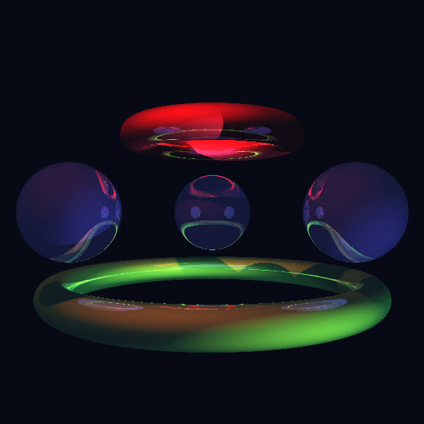

# 3D Fire simulation

Запуск
-

Необходимо установить [компилятор dlang](https://dlang.org/download.html). Для DMD запуск будет выглядеть так:
```sh
rdmd main.d <width> <heigth>
```

Описание
-

Этот проект - симуляция трехмерного огня с помощью алгоритма реймарчинга и случайных процессов.

На данный момент в проекте есть:
- библиотека для работы с векторами `module geom.vec`
- общая реализация алгоритма реймарчинга для отрисовки объектов
- тор, шар, плоскость
- тени, отражение
- anti-aliasing

TODO list:
- добавить рефракцию
- добавить смешивание объектов (вычитание, xor, гладкое смешивание)

Из интересного
-

- Проект не имеет зависимостей от сторонних библиотек
- Для отрисовки используется простой формат для хранения изображений: [PPM](https://netpbm.sourceforge.net/doc/ppm.html)
- Используется [модель освещения Фонга](https://en.wikipedia.org/wiki/Phong_reflection_model)
- Во время написания возникла задача: пусть `f(v)` - функция, которая по вектору `v` выдает любой вектор, перпендикулярный ему, то есть `forall v: dot(f(v), v) = 0`, но с дополнительным условием, чтобы решение было содержательным: если `v != 0`, то и `f(v) != 0`. В двумерном пространстве это просто: например, `f((x,y)) = (y,-x)` (это можно обобщить до 2n-мерного: `f((x,y,z,w)) = (y,-x,w,-z)`). А вот в трехмерном, как оказалось, невозможно подобрать такую непрерывную `f` из за [теоремы о причесывании ежа](https://ru.wikipedia.org/wiki/%D0%A2%D0%B5%D0%BE%D1%80%D0%B5%D0%BC%D0%B0_%D0%BE_%D0%BF%D1%80%D0%B8%D1%87%D1%91%D1%81%D1%8B%D0%B2%D0%B0%D0%BD%D0%B8%D0%B8_%D0%B5%D0%B6%D0%B0). То есть нельзя написать такую, казалось бы простую, функцию без `if`/тернарного оператороа/учета знака. В итоге я сделал [так](/geom/vec.d#L151).

Пример сгенерированного изображения
-

